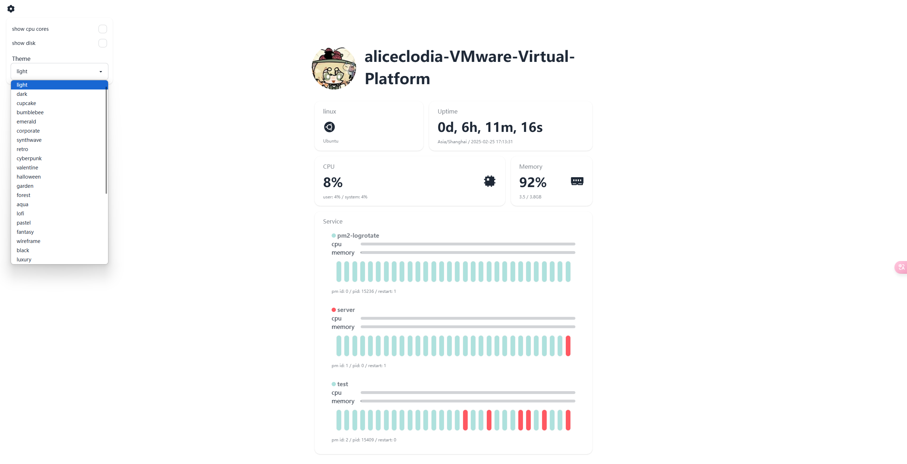

## server_monitoring

这是一个 pm2 监测站点, 前端使用 vue.js 搭建, 后端使用 node.js 搭建, 通过 socket 和服务器建立实时连接, 实时获取服务器性能数据, 并展示在页面上.

前排叠甲: 本项目出于学习和娱乐目的, 代码写的不好, 请路过的大佬嘴下留情. 有需要的专业人士请移步pm2的官方监控项目 https://pm2.io/

本项目有两个前端页面, 一个是 server_monitoring, 一个是 W2W.

server_monitoring 是旧页面,已经不再维护, W2W 是新的页面.

server_monitoring:


W2W:


## 使用

```bash
git clone https://github.com/sooooooooooooooooootheby/server_monitoring.git
```

### 从后端开始

首先将 `server_side` 放到你的服务器上, 并启动它.

```bash
cd server_side
pnpm i
pm2 start src/main.js --name server_monitoring --time
```

你还需要在服务端安装一个 pm2 的插件.

```bash
pm2 install pm2-logrotate
```

配置一下 nginx, 在你的`server`块下添加这个`location`块.

```conf
location /server_monitoring/ {
    proxy_set_header X-Forwarded-For $proxy_add_x_forwarded_for;
    proxy_set_header Host $host;

    proxy_pass http://localhost:4568;

    proxy_http_version 1.1;
    proxy_set_header Upgrade $http_upgrade;
    proxy_set_header Connection "upgrade";
}
```

至此, 后端的部署就完成了!

后端可修改的项:

-   每次向前端发送数据的间隔时长: `/server_side/src/main.js` 的 `time`, 默认值是`1000000`, 请不要将这个值设置得过小, 否则服务器会崩溃, 目前还没有其他方案来解决这个问题.
-   后端监听的端口: `/server_side/src/main.js` 的 `port`, 默认值是`4568`, 不建议修改这个项, 如果发送了冲突, 修改这个项时请将 nginx 中的`proxy_pass` 的接口也修改掉.
-   最大连接客户端: `/server_side/src/main.js` 的 `maxConnections`, 默认值是`5`. 实际最大连接数是设置的值-1, 即设置为 5 实际最大连接数是 4.

### 现在到前端

前端可以部署在你的服务器上, 也可选择在线部署到`github pages`或者`vercel`上.

如果需要在线部署请 fork 一份修改前端页面.

因为我使用`vercel`, 所以接下来我将说明如何部署到`vercel`上, 关于如何部署在服务器上请自行摸索, 这个项目并不复杂, 遇到问题可以提 issues, 只要我有空我是乐意帮你解决问题的.

fork 之后 clone 到你的电脑上, 打开`/W2W/src/App.vue`, 滑到`<script>`部分.

修改这个部分的代码:

将`https://api.s22y.moe`修改为你的网站的地址, 即之前添加的`location`块所属的`server`的`server_name`.

```javascript
const socket = io("https://api.s22y.moe", {
    path: "/server_monitoring/",
});
```

替换 logo 直接替换掉`/W2W/public/logo.png`即可, 网站的标题请修改`index.html`的`<title>`标签.

然后打开`vercel`部署即可!

> 你问我怎么在vercel部署? https://google.com/ 请

恭喜你, 至此你完成了项目的部署! 🎉 奖励一下自己.
