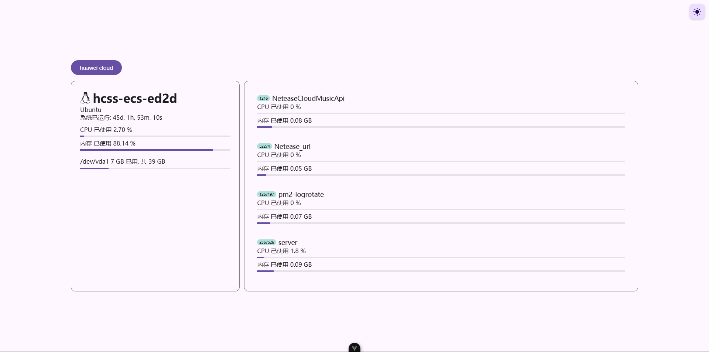

## server_monitoring_page

这是一个pm2监测站点, 前端使用 vue.js 搭建, 后端使用 node.js 搭建, 通过 socket 和服务器建立实时连接, 实时获取服务器性能数据, 并展示在页面上.

## 运行

### 后端

1. 进入后端文件夹

```bash
cd server_monitoring
```

2. 安装依赖

```bash
pnpm i
```

3. 启动项目

```bash
node /src/main.js
```

### 前端

1. 进入前端文件夹

```bash
cd server_monitoring
```

2. 安装依赖

```bash
pnpm i
```

3. 启动项目

```bash
pnpm run dev
```

4. 打开浏览器, 输入 `http://localhost:5173` 即可访问.



## 使用

可以自定义后端端口以及数据返回间隔, 只需要修改 `server_side/src/main.js` 中的 `port` 和 `time`(单位ms) 即可.

注意! 请不要将时间修改过短, 你也不想看见服务崩溃吧.

``` js
const port = 4568;
const time = 300000;
```

可以添加多个服务器, 只需要修改 `/server_monitoring/src/App.vue`中的 `server_list` 数组即可.

``` js
const server_list = ref([
    {
        name: "huawei cloud",                               # 展示的名字
        url: "https://api.sooooooooooooooooootheby.top",    # 服务器地址
        path: "/server_monitoring/",                        # 如果使用了nginx, 需要填写nginx的路径
    },
]);
```